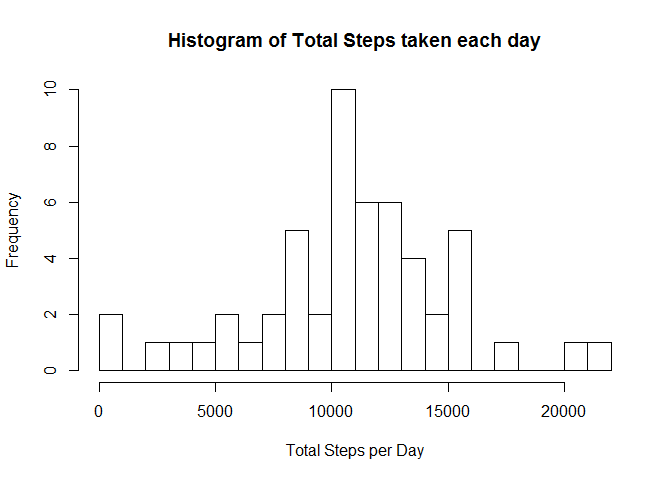

# Reproducible Research: Peer Assessment 1

## Loading and preprocessing the data

```r
library(utils)
unzip("activity.zip")
actdata<-read.csv("activity.csv")

#Covenvert the date column to POSIXct format
actdata$date<-as.POSIXct(strptime(actdata$date, format="%Y-%m-%d"))
```


## What is mean total number of steps taken per day?

The following is the Histogram of the total steps in each day.

```r
library(dplyr)
```

```
## 
## Attaching package: 'dplyr'
## 
## The following object is masked from 'package:stats':
## 
##     filter
## 
## The following objects are masked from 'package:base':
## 
##     intersect, setdiff, setequal, union
```

```r
#Extract the records without NA
good<-complete.cases(actdata)
actdata1<- actdata[good, ]

#group the records into dates
act_by_date<-group_by(actdata1, date)
sum_by_date<-summarize(act_by_date, total_steps=sum(steps))
hist(sum_by_date$total_steps, breaks=20, main="Histogram of Total Steps taken each day", xlab="Total Steps per Day")
```

 


```r
mean_step<-as.character(round(mean(sum_by_date$total_steps),digits=2))
median_step<-median(sum_by_date$total_steps)
```

The mean total number of steps taken each day is 10766.19.
The median total number of steps taken each day is 10765.

## What is the average daily activity pattern?

The Following shows the average steps taken each 5 minutes interval:

```r
#group the records into Intervals
act_by_intv<-group_by(actdata1, interval)

#Calculate the mean of the average steps
avg_by_intv<-summarize(act_by_intv, avg_steps=mean(steps))

#Plot the Mean Steps each 5 minutes
with (avg_by_intv, plot(interval, avg_steps, main="Plot of Average Steps Taken each Five Minutes", xlab="Interval", ylab="Mean Steps",type="l"))
```

 


```r
max_intv <- as.integer(avg_by_intv[which.max(avg_by_intv$avg_steps),][1])
```
The Interval that carries the maximum number of steps is 835. 

## Imputing missing values

```r
missRnum <- nrow(actdata)-sum(complete.cases(actdata))
nainSteps <- sum(is.na(actdata$steps))
nainIntv <- sum(is.na(actdata$interval))
nainDate <- sum(is.na(actdata$date))
```
The nubmer of rows with NA values are `missRnum`. There are no only missing values in steps.

  As shown in the activity dataset, there are some days with complete missing data. The most applicable and convenient method is to use the average values of the steps of the specific intervals to fill in the missing values. The average values of steps are coverted to intergers before usage. The disavantage of this method is that there will be bias conclusion if the data group by interval is bias.

  The following is the implementation method:

```r
#build a new dataset

actdata2<-actdata
for (i in 1:(nrow(actdata2))) {
#locate the missing values.  
  if (is.na(actdata2$steps[i])) {
    #locate the interval of the missing values.
    fromIntv<-actdata2$interval[i]
    actdata2$steps[i] <- as.integer(round(avg_by_intv$avg_steps[which(avg_by_intv$interval==fromIntv)]))  
    }
}
```

  The following is the Histogram after filling in the Nas:

```r
#group the records into dates
act_by_date2<-group_by(actdata2, date)
sum_by_date2<-summarize(act_by_date2, total_steps=sum(steps))
hist(sum_by_date2$total_steps, breaks=20, main="Histogram of Total Steps Taken Each Day After Filled", xlab="Total Steps per Day")
```

 


```r
mean_step2<-as.character(round(mean(sum_by_date2$total_steps),digits=2))
median_step2<-median(sum_by_date2$total_steps)
```

The mean total number of steps taken each day is 10765.64.
The median total number of steps taken each day is 10762.

By obeservation, the mean and meadian are slightly different than the the ones with missing data. It was expected that the mean would be the same. The discrepancy is due to the data of steps to fill in the NA values are required to converted to intergers before usage, where some digits are lost.


## Are there differences in activity patterns between weekdays and weekends?

First create the weekday factor into the dataset

```r
#Add the weekday factor into the dataset
actdata2$weekday<-(ifelse(weekdays(actdata2$date)==c("Sunday","Saturday"), "weekend","weekday"))
```

Plot the data by weekdays

```r
#split the data based on weekday factor
actdata3<-split(actdata2,actdata2$weekday)
#group the records into Intervals
act_by_intv2<-lapply(actdata3, group_by, interval)

#Calculate the mean of the average steps
avg_by_intv2<-lapply(act_by_intv2, summarize,avg_steps=mean(steps))

#Plot the graph
par(mfrow=c(2,1))

plot(avg_by_intv2[[2]]$avg_steps~avg_by_intv2[[2]]$interval,main="Weekend",xlab="Interval", ylab="Average Steps", type="l")

plot(avg_by_intv2[[1]]$avg_steps~avg_by_intv2[[1]]$interval,main="Weekday",xlab="Interval", ylab="Average Steps", type="l")
```

 


